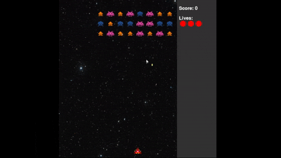
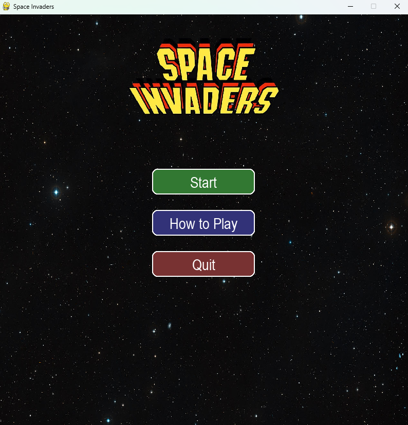
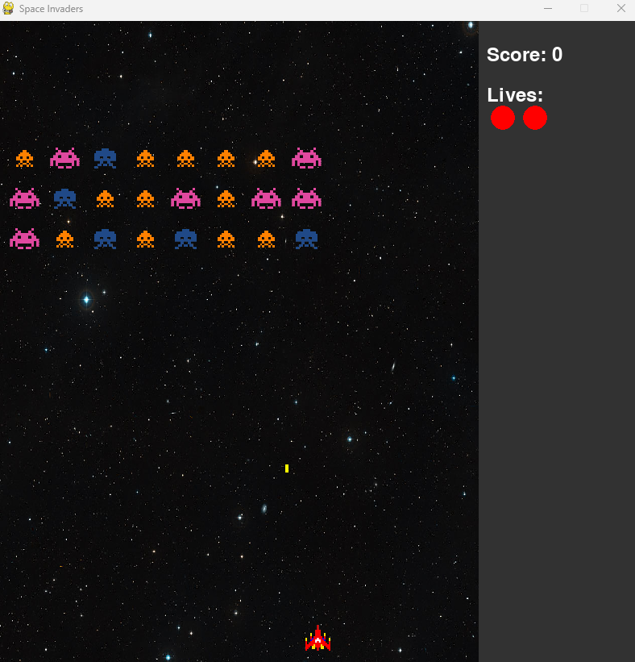

# 🚀 Space Invaders in Python  
Clone del classico videogioco **Space Invaders**, sviluppato in **Python** utilizzando **Pygame**.  
Il progetto nasce come esercizio accademico e personale, con l’obiettivo di approfondire concetti di **programmazione a oggetti**, **gestione di eventi in tempo reale** e **grafica 2D interattiva**.  

---

## 🎮 Demo

  

  
  

## ⚙️ Tecnologie utilizzate
- 🐍 Python 3.x  
- 🎨 Pygame (grafica, input e audio)

---

## 📂 Struttura del progetto
SpaceInvaders/

├── src/         # codice sorgente

├── assets/      # immagini e suoni

└── requirements.txt

---

## 📦 Installazione
1. Clona il repository:
git clone https://github.com/Gualt17/Space-Invaders-Python.git
cd space-invaders-python

2. Installa le dipendenze:
pip install -r requirements.txt

3. Avvia il gioco:
python main.py

---

## 🕹️ Comandi di base
⬅️ ➡️ Freccia sinistra/destra → movimento

⬆️ Spazio → spara

---

## 🌟 Funzionalità
- Movimento del giocatore e nemici
- Colpi e collisioni
- Punteggio e Vite in tempo reale
- Grafica in stile retro

---

## 🚀 Miglioramenti futuri
- Possibilità di scegliere la difficoltà
- Power-up e armi speciali
- Tabellone con punteggi salvati localmente
- Miglioramento della parte grafica

---

## 👨‍💻 Autore
Sviluppato da **Carmine Gualtieri**

📧 [Email](mailto:gualtieri.cb21@gmail.com)  
🔗 [LinkedIn](https://www.linkedin.com/in/carmine-gualtieri-580562358) | [GitHub](https://github.com/Gualt17)  
