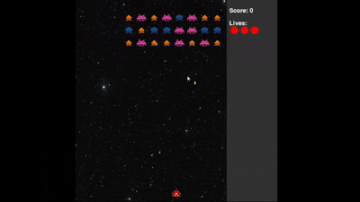
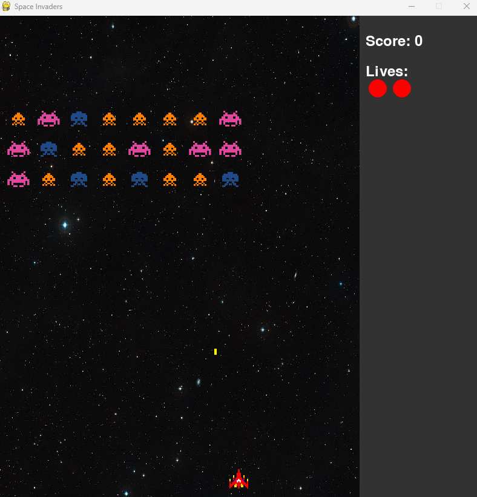

🌍 Available languages: [English](README.md) | [Italiano](README.it.md)

# 🚀 Space Invaders in Python  
Clone of the classic **Space Invaders** game, developed in **Python** using **Pygame**.  
This project was created as both an academic and personal exercise, with the goal of exploring **object-oriented programming**, **real-time event handling**, and **interactive 2D graphics**.   

---

## 🎮 Demo

  

  
  

## ⚙️ Technologies
- 🐍 Python 3.x  
- 🎨 Pygame (graphics, input & audio)  

---

## 📂 Project's structure
SpaceInvaders/

├── src/         # source code

├── assets/      # images and sounds

└── requirements.txt

---

## 📦 Installation
1. Clone the repository:
git clone https://github.com/Gualt17/Space-Invaders-Python.git
cd space-invaders-python

2. Install dependencies:
pip install -r requirements.txt

3. Run the game:
python main.py

---

## 🕹️ Controls

⬅️ ➡️ Left/Right arrows → move

⬆️ Space → shoot

---

## 🌟 Features
- Player and enemy movement
- Shooting and collisions
- Real-time score and lives
- Retro-style graphics

---

## 🚀 Future Improvements
- Option to select difficulty levels
- Power-ups and special weapons
- Local high score leaderboard
- Enhanced graphics

---

## 👨‍💻 Author
Developed by **Carmine Gualtieri**

📧 [Email](mailto:gualtieri.cb21@gmail.com)  
🔗 [LinkedIn](https://www.linkedin.com/in/carmine-gualtieri-580562358) | [GitHub](https://github.com/Gualt17)  
